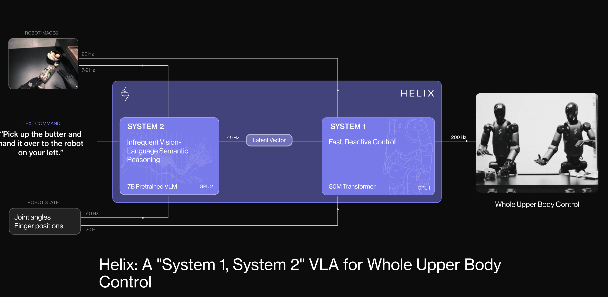

# 🌟 Top Vision-Language-Action (VLA) Models

🔥🔥🔥 **RT-2: Robotics Transformer 2 — End-to-End Vision-Language-Action Model**  

[Project Page](https://robotics-transformer2.github.io/) | [Paper](https://arxiv.org/abs/2307.15818)
  

Integrates vision-language models trained on internet-scale data directly into robotic control pipelines. ✨

---

🔥🔥🔥 **Helix: Generalist VLA Model for Full-Body Humanoid Control**  

[Official Announcement](https://www.figure.ai/news/helix)
  

The first VLA model to enable full upper-body humanoid control, including fingers, wrists, torso, and head. ✨

---

🔥🔥🔥 **π0 (Pi-Zero): Generalist VLA Across Diverse Robots**  

[Hugging Face Blog](https://huggingface.co/blog/pi0)
  

Generalist control model across various robotic embodiments, utilizing large-scale pretraining and flow matching action generation. ✨

---

🔥🔥🔥 **OpenVLA: Open-Source Large-Scale Vision-Language-Action Model**  

[Project Page](https://openvla.github.io/)
  

Pretrained on 970k+ robotic episodes, setting a new benchmark for generalist robotic policies. ✨

---

🔥🔥🔥 **Gemini Robotics: Multimodal Generalization to Physical Action**  

[The Verge Report](https://www.theverge.com/news/628021/google-deepmind-gemini-robotics-ai-models)
  

Built on Gemini 2.0, enabling complex real-world manipulation without task-specific training. ✨

---

# 📋 Table Overview of Top Vision-Language-Action (VLA) Models

| Model | Organization | Key Contribution | Paper | Project | Hugging Face |
|:---|:---:|:---|:---:|:---:|:---:|
| **RT-2** | Google DeepMind | Co-fine-tunes on robot data and internet-scale VLM data for semantic robotic reasoning. | [Link](https://arxiv.org/abs/2307.15818) | [Link](https://robotics-transformer2.github.io/) | - |
| **Helix** | Figure AI | First model achieving full upper-body humanoid control (finger, torso, head). | - | [Link](https://www.figure.ai/news/helix) | - |
| **π0 (Pi-Zero)** | Physical Intelligence | Flow matching action generation for cross-robot generalist control. | - | [Link](https://huggingface.co/blog/pi0) | - |
| **OpenVLA** | Stanford | Open-sourced 7B VLA model trained on 970k+ robotic episodes, supports multi-robot fine-tuning. | [Link](https://arxiv.org/abs/2406.09246) | [Link](https://openvla.github.io/) | [Link](https://huggingface.co/openvla/openvla-7b) |
| **Gemini Robotics** | Google DeepMind | Built on Gemini 2.0, performs real-world physical actions without task-specific training. | - | [Link](https://www.theverge.com/news/628021/google-deepmind-gemini-robotics-ai-models) | - |

---

# 📑 Table of Contents

- [🔥 Top Vision-Language-Action (VLA) Models](#-top-vision-language-action-vla-models)
- [📋 Table Overview of Top Vision-Language-Action (VLA) Models](#-table-overview-of-top-vision-language-action-vla-models)

