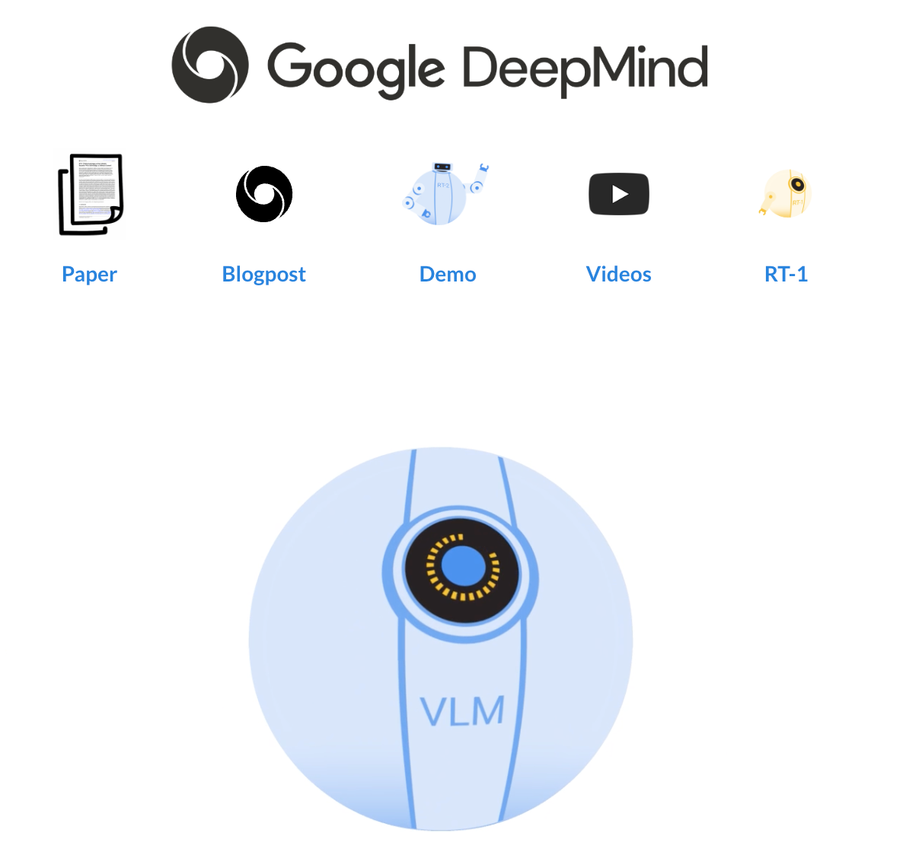

  <h1>Awesome Vision-Language-Action (VLA) Models</h1>
  
  

This is a collection of research papers about Embodied Multimodal Large Language Models (VLA models).

If you would like to include your paper or update any details (e.g., code URLs, conference information), please feel free to submit a pull request. Any advice is also welcome!

# 📑 Table of Contents
- [Awesome VLA Models](#awesome-vla-models)
- [Awesome Papers](#awesome-papers)
- [Awesome Datasets and Benchmarks](#awesome-datasets-and-benchmarks)

# Awesome VLA Models

🔥🔥🔥 **RT-2: Robotics Transformer 2 — End-to-End Vision-Language-Action Model**  

  
   
  [[📖 Paper](https://arxiv.org/abs/2307.15818)] [[🌟 Project](https://robotics-transformer2.github.io/)]

  
Integrates vision-language models trained on internet-scale data directly into robotic control pipelines. ✨

---

🔥🔥🔥 **Helix: Generalist VLA Model for Full-Body Humanoid Control**  

  
   
  [[🌟 Project](https://www.figure.ai/news/helix)]

  
First VLA model achieving full upper-body humanoid control including fingers, wrists, torso, and head. ✨

---

🔥🔥🔥 **π0 (Pi-Zero): Generalist VLA Across Diverse Robots**  

  [[🌟 Project](https://huggingface.co/blog/pi0)]

  
Generalist control across various robot embodiments, utilizing large-scale pretraining and flow matching action generation. ✨

---

🔥🔥🔥 **OpenVLA: Open-Source Large-Scale Vision-Language-Action Model**  

  [[📖 Paper](https://arxiv.org/abs/2406.09246)] [[🌟 Project](https://openvla.github.io/)] [[🤖 Hugging Face](https://huggingface.co/openvla/openvla-7b)]

  
Pretrained on 970k+ robotic episodes, setting a new benchmark for generalist robotic policies. ✨

---

🔥🔥🔥 **Gemini Robotics: Multimodal Generalization to Physical Action**  

  
   
  [[🌟 Project](https://www.theverge.com/news/628021/google-deepmind-gemini-robotics-ai-models)]

  
Built on Gemini 2.0, enabling complex real-world manipulation without task-specific training. ✨

---

# Awesome Papers

| Title | Introduction | Date | Code |
|:---|:---|:---|:---|
| [PaLM-E: An Embodied Multimodal Language Model](https://arxiv.org/abs/2303.03378) | PaLM-E integrates perception, language, and action for embodied AI. | 2023-03-06 | - |
| [EmbodiedGPT: Vision-Language Pre-Training via Embodied Chain of Thought](https://arxiv.org/abs/2305.15021) | Embodied GPT trains vision-language models for embodied reasoning via chain-of-thought pretraining. | 2023-05-24 | [Github](https://github.com/EmbodiedGPT/EmbodiedGPT_Pytorch) |
| [Co-LLM-Agents: Building Cooperative Embodied Agents Modularly with LLMs](https://arxiv.org/abs/2307.02485) | Modular framework using LLMs to build cooperative embodied agents. | 2023-07-05 | [Github](https://github.com/UMass-Foundation-Model/Co-LLM-Agents) |
| [RT-2: Vision-Language-Action Models Transfer Web Knowledge to Robotic Control](https://arxiv.org/abs/2307.15818) | RT-2 transfers VLM internet knowledge to robotic control tasks. | 2023-07-28 | - |
| [Large Language Models as Generalizable Policies for Embodied Tasks](https://arxiv.org/abs/2310.17722) | Apple proposes LLMs as generalizable policies for embodied environments. | 2023-10-26 | [Github](https://github.com/apple/ml-llarp) |
| [An Embodied Generalist Agent in 3D World](https://arxiv.org/abs/2311.12871) | Introduces a generalist agent operating in 3D worlds. | 2023-11-18 | [Github](https://github.com/IST-DASLab/sparsegpt) |
| [LL3DA: Visual Interactive Instruction Tuning for Omni-3D Understanding, Reasoning, and Planning](https://arxiv.org/abs/2311.18651) | Omni-3D understanding via instruction tuning. | 2023-11-30 | [Github](https://github.com/Open3DA/LL3DA) |
| [Towards Learning a Generalist Model for Embodied Navigation (NaviLLM)](https://arxiv.org/abs/2312.02010) | Learning generalist models for vision-language navigation tasks. | 2023-12-04 | [Github](https://github.com/zd11024/NaviLLM) |
| [MP5: A Multi-modal Open-ended Embodied System in Minecraft](https://arxiv.org/abs/2312.07472) | Open-ended embodied agent in Minecraft with multimodal active perception. | 2023-12-12 | [Github](https://github.com/IranQin/MP5) |
| [ManipLLM: Embodied Multimodal LLM for Object-Centric Robotic Manipulation](https://arxiv.org/abs/2312.16217) | Object-centric robotic manipulation using multimodal LLMs. | 2023-12-24 | [Github](https://github.com/clorislili/ManipLLM) |
| [MultiPLY: A Multisensory Object-Centric Embodied LLM in 3D World](https://arxiv.org/abs/2401.08577) | Embodied LLM that learns in multisensory 3D worlds. | 2024-01-16 | [Github](https://github.com/UMass-Foundation-Model/MultiPLY) |
| [NaVid: Video-based VLM Plans the Next Step for Vision-and-Language Navigation](https://arxiv.org/abs/2402.15852) | Planning next navigation steps with video-based vision-language models. | 2024-02-24 | - |
| [ShapeLLM: Universal 3D Object Understanding for Embodied Interaction](https://arxiv.org/abs/2402.17766) | Universal 3D object understanding via LLMs for embodied agents. | 2024-02-27 | [Github](https://github.com/qizekun/ShapeLLM) |
| [3D-VLA: A 3D Vision-Language-Action Generative World Model](https://arxiv.org/abs/2403.09631) | A generative 3D world model for vision-language-action learning. | 2024-03-14 | [Github](https://github.com/UMass-Foundation-Model/3D-VLA) |
| [RoboMP²: A Robotic Multimodal Perception-Planning Framework](https://arxiv.org/abs/2404.04929) | Multimodal perception and planning framework for robotics. | 2024-04-07 | - |
| [Helix: Full-Body Humanoid Control Model](https://www.figure.ai/news/helix) | First model achieving full upper-body humanoid control. | 2024-04 | [Project](https://www.figure.ai/news/helix) |
| [Embodied CoT Distillation From LLM To Off-the-shelf Agents](https://openreview.net/pdf?id=M4Htd52HMH) | Distills embodied chain-of-thought reasoning into standard agents. | 2024-05-02 | - |
| [Gemini Robotics](https://www.theverge.com/news/628021/google-deepmind-gemini-robotics-ai-models) | Real-world physical actions without task-specific training. | 2024-05 | [Project](https://www.theverge.com/news/628021/google-deepmind-gemini-robotics-ai-models) |
| [A3VLM: Actionable Articulation-Aware Vision Language Model](https://arxiv.org/abs/2406.07549) | Enhances VLMs for actionable articulated objects. | 2024-06-11 | [Github](https://github.com/changhaonan/A3VLM) |
| [OpenVLA: An Open-Source Vision-Language-Action Model](https://arxiv.org/abs/2406.09246) | Open-sourced 7B VLA model trained on large robotic datasets. | 2024-06-13 | [Github](https://github.com/openvla/openvla) |
| [TinyVLA](https://arxiv.org/abs/2409.12514) | Compact VLA models with faster inference and better efficiency. | 2024-09 | [Paper](https://arxiv.org/abs/2409.12514) |
| [VLA Model-Expert Collaboration](https://arxiv.org/abs/2503.04163) | Improves VLA performance by collaborating with expert actions. | 2025-03 | [Paper](https://arxiv.org/abs/2503.04163) |

---

# Awesome Datasets and Benchmarks

## 🏗️ Scene / Environment Generation

| Title | Introduction | Date | Code |
|:---|:---|:---|:---|
| [Holodeck: Language Guided Generation of 3D Embodied AI Environments](https://arxiv.org/abs/2312.09067) | Enables LLMs to generate interactive 3D simulation environments. | 2023-12-14 | [Github](https://github.com/allenai/Holodeck) |
| [PhyScene: Physically Interactable 3D Scene Synthesis for Embodied AI](https://arxiv.org/pdf/2404.09465) | Introduces physically interactive 3D environments for robust embodied AI training. | 2024-04-15 | [Github](https://github.com/PhyScene/PhyScene/tree/main) |

## 🧠 Question Answering / Language Interaction Benchmarks

| Title | Introduction | Date | Code |
|:---|:---|:---|:---|
| [OpenEQA: Embodied Question Answering in the Era of Foundation Models](https://openaccess.thecvf.com/content/CVPR2024/papers/Majumdar_OpenEQA_Embodied_Question_Answering_in_the_Era_of_Foundation_Models_CVPR_2024_paper.pdf) | Embodied visual QA benchmark targeting real-world scenes. | 2024-06-17 | [Github](https://github.com/facebookresearch/open-eqa) |
| [EQA-REAL: Real-world Embodied Question Answering](https://arxiv.org/abs/2404.13083) | Real-world version of EmbodiedQA focused on indoor environments. | 2024-04 | [Github](https://github.com/facebookresearch/eqa-real) |
| [TEACh: Task-driven Embodied Dialogues Dataset](https://arxiv.org/abs/2109.00582) | Human-human dialogues in embodied tasks (navigation + manipulation). | 2023 update (original 2021) | [Github](https://github.com/alexa/teach) |

## 👀 Multi-Modal Perception Datasets

| Title | Introduction | Date | Code |
|:---|:---|:---|:---|
| [EmbodiedScan: A Holistic Multi-Modal 3D Perception Suite](https://arxiv.org/abs/2312.16170) | Real-world RGB-D + language data from 3D scans for embodied agents. | 2023-12-26 | [Github](https://github.com/OpenRobotLab/EmbodiedScan) |

## 🕹️ End-to-End Embodied Decision Making / Simulators

| Title | Introduction | Date | Code |
|:---|:---|:---|:---|
| [PCA-EVAL: Towards End-to-End Embodied Decision Making via Multi-modal LLMs](https://arxiv.org/abs/2310.02071) | Benchmarks evaluating decision-making abilities via GPT4-V and beyond. | 2023-10-03 | [Github](https://github.com/pkunlp-icler/PCA-EVAL) |
| [Learning Interactive Real-World Simulators (UniSim)](https://arxiv.org/abs/2310.06114) | Learning interactive simulators directly from real-world data. | 2023-10-09 | - |

## 🏡 Household Activities / Task Benchmarks

| Title | Introduction | Date | Code |
|:---|:---|:---|:---|
| [BEHAVIOR-1K: A Benchmark for Household Activities](https://arxiv.org/abs/2307.07263) | 1,000 household activity programs and scenes for embodied agents. | 2023-07-11 | [Project](https://behavior.stanford.edu/) |
